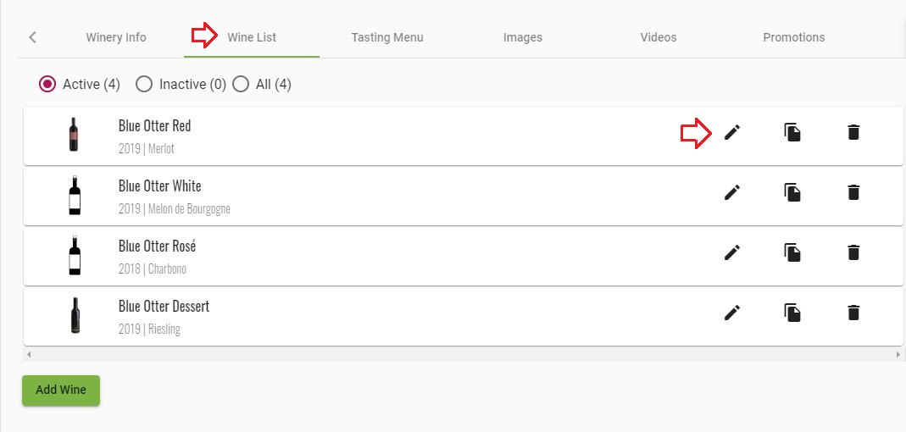
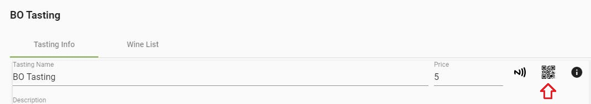

### [Back to Contents](articles/content.md)
# Introduction

What if you could effortlessly pick that perfect wine for the occasion? Know if it’s time to drink it, or learn the story of the bottle in your hand from the winemakers? Uncork the knowledge of experts on that wine with a tap, swipe and scroll–BottleVin makes it easy.  

Just click your store link to get access to some of our great features like view tasting room flights, creating a collection, or adding notes to your favorite wines!

### [Back to Contents](articles/content.md)

### How to Generate a QR Code for the Winery

1. Click on Pencil icon to reach the winery info screen

2. Click on the QR icon near the Winery name 

then download the QR code that has been shown up

### How to Generate a QR Code for the Wine

1. Click on Pencil icon to reach the winery info screen

2. Click on the "Wine List" tab, then the pencil icon

3. Click on the QR icon near the Wine name

then download the QR code that has been shown up

### How to Generate a QR Code for the Tasting

1. Click on Pencil icon to reach the winery info screen

2. Click on the "Tasting Menu" tab, then the pencil icon

3. Click on the QR icon near the Tasting name

then download the QR code that has been shown up

