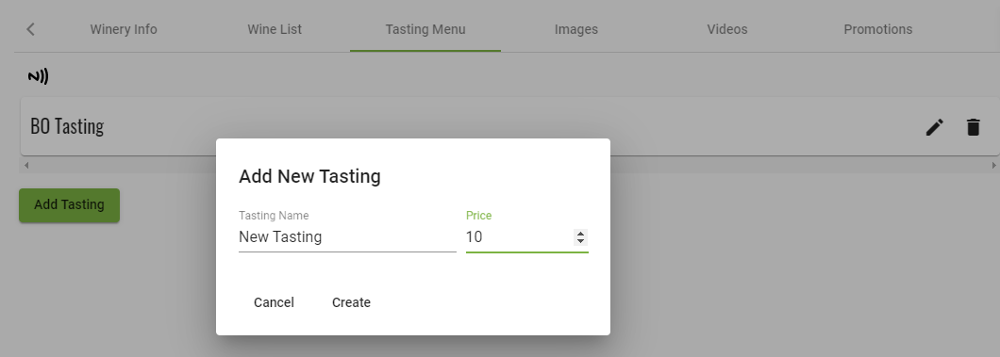
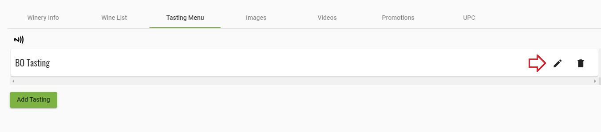
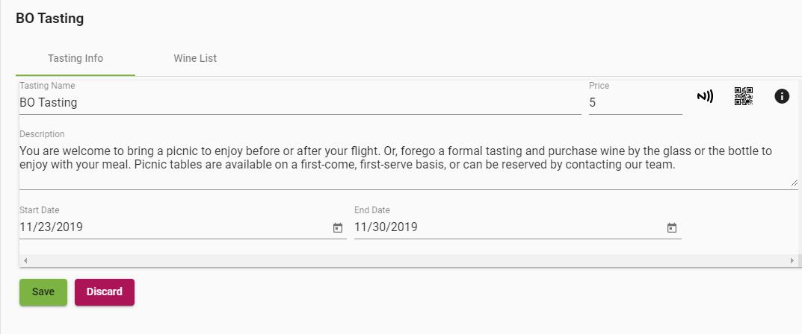
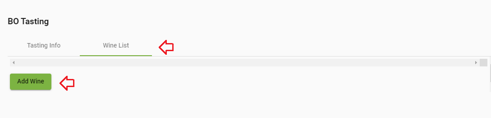
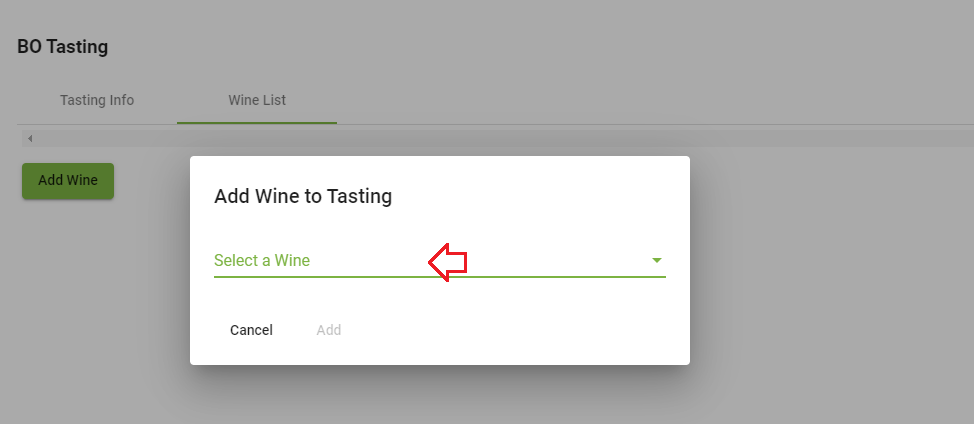
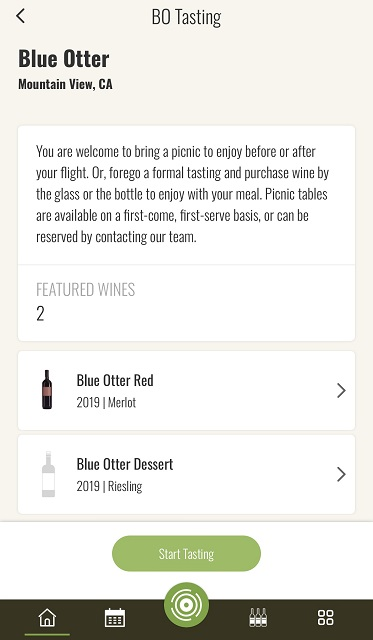

### [Back to Contents](articles/content.md)
# Introduction

What if you could effortlessly pick that perfect wine for the occasion? Know if it’s time to drink it, or learn the story of the bottle in your hand from the winemakers? Uncork the knowledge of experts on that wine with a tap, swipe and scroll–BottleVin makes it easy.  

Just click your store link to get access to some of our great features like view tasting room flights, creating a collection, or adding notes to your favorite wines!

### [Back to Contents](articles/content.md)

# How to Create a Tasting

1. Click on Pencil icon to reach the winery info screen

2. Click on the "Tasting Menu" tab, then "Add Tasting" button

3. Add a "Tasting Name" and "Price", then press "Create"

4. Click the "Pencil" icon to edit the tasting.

5. Add a description. Start and End dates are optional.

6. Add your wines by clicking the "Wine List" tab, then clicking "Add Wine" and "Select a Wine". Wines need to be in your wine list in order to add them.

7. Check the content looks correct in the BottleVin Demo app, then send us an email to make it live to the public!

