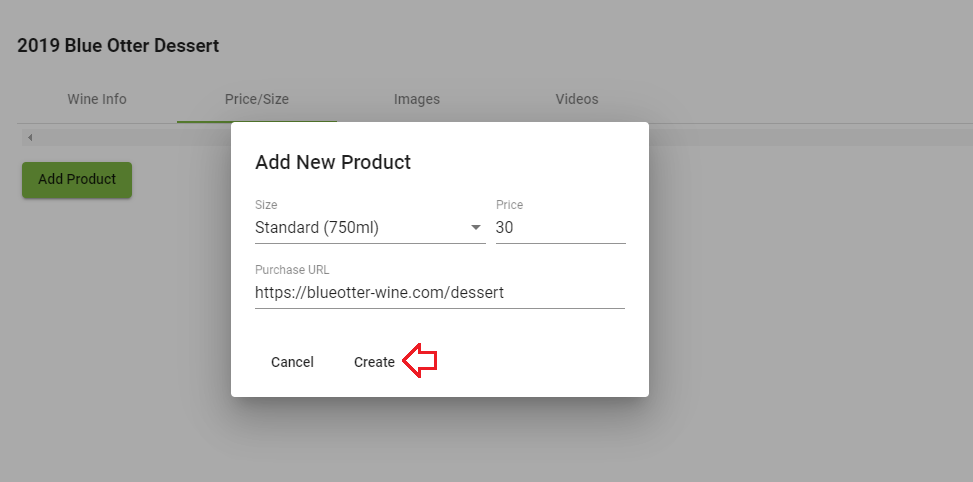

### [Back to Contents](articles/content.md)
# Introduction

What if you could effortlessly pick that perfect wine for the occasion? Know if it’s time to drink it, or learn the story of the bottle in your hand from the winemakers? Uncork the knowledge of experts on that wine with a tap, swipe and scroll–BottleVin makes it easy.  

Just click your store link to get access to some of our great features like view tasting room flights, creating a collection, or adding notes to your favorite wines!

# How to Create a Wine

## 1. Click on Pencil icon to reach the winery info screen

## 2. Click on the "Wine List" tab, then "Add Wine" button

## 3. Add a "Name", "Vintage", "Varietal" and "Type" then press "Create"

## 4. Click the "Pencil" icon to edit the wine.

## 5. Add a description. (Optional)

## 6. Add the image of the wine which will be displayed in-app. You can enter an image's URL or upload an image from local.

## 7. Add the label of the wine which will be used for the scanning feature. You can enter an image's URL or upload an image from local.

## 8. Click on "Price/Size" tab, then "Add Product" to add "Size", "Price" and "Purchase URL" of a product. (Optional)

## 9. Click on "Images" tab, then "Upload Image" to upload images of the wine from you local. (Optional)

## 10. Click on "Videos" tab, then enter the video's URL of the wine. (Optional)

## 11. Check the content looks correct in the BottleVin Demo app, then send us an email to make it live to the public!

