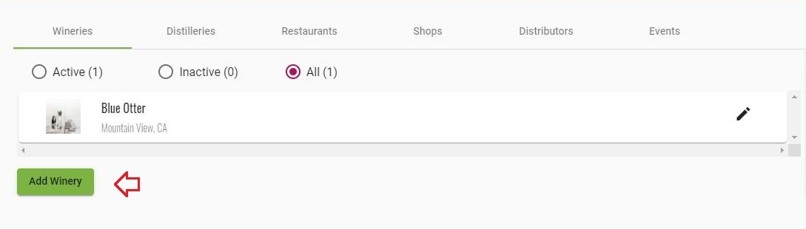
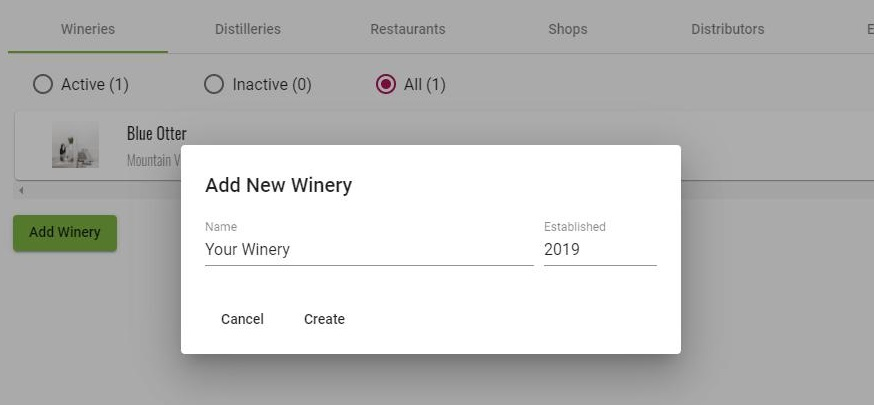
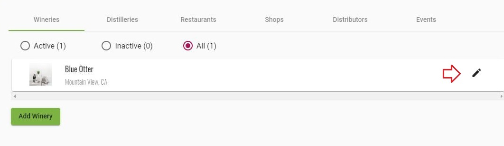

### [Back to Contents](articles/content.md)
# Introduction

What if you could effortlessly pick that perfect wine for the occasion? Know if it’s time to drink it, or learn the story of the bottle in your hand from the winemakers? Uncork the knowledge of experts on that wine with a tap, swipe and scroll–BottleVin makes it easy.  

Just click your store link to get access to some of our great features like view tasting room flights, creating a collection, or adding notes to your favorite wines!

# How to Create a Winery

## 1. Click on "Add Winery button"

## 2. Add "Name" and "Established" then press "Create"

## 3. Click on Pencil icon to edit your winery

